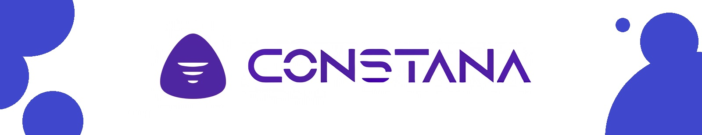

# CONSTANA - Mar Del Plata Programa

El repositorio almacena el material de trabajo y ejercicios que se vayan presentando a lo largo de la capacitación.

Clases:

<a href="https://danielherrer.github.io/CONSTANA_MDP_Programa/04_web_cv_2.0_css/index.html">Actividad - Web CV 2.0</a>

<a href="https://danielherrer.github.io/CONSTANA_MDP_Programa/05_web_formularioDiseño/index.html">Actividad - Web Formulario con Diseño</a>

<a href="https://danielherrer.github.io/CONSTANA_MDP_Programa/11_web_loginLocalStore/index.html">Actividad - Web Login + Carrito</a>

Laboratorios:

<a href="https://danielherrer.github.io/CONSTANA_MDP_Programa/02_web_tablasLaboratorio/index.html">Laboratorio - Web Tablas</a>

<a href="https://danielherrer.github.io/CONSTANA_MDP_Programa/06_web_comidasLaboratorio/index.html">Laboratorio - Web ConstanaKing</a>

<a href="https://danielherrer.github.io/CONSTANA_MDP_Programa/09_web_gridFlexLaboratorio/index.html">Laboratorio - Web D&D Responsive</a>

<a href="https://danielherrer.github.io/CONSTANA_MDP_Programa/10_web_bootstrapLaboratorio/web/index.html">Laboratorio - Web Ropa Bootstrap</a>

<a href="https://danielherrer.github.io/CONSTANA_MDP_Programa/12_web_memoTest/index.html">Laboratorio - Web Memo TEST</a>
